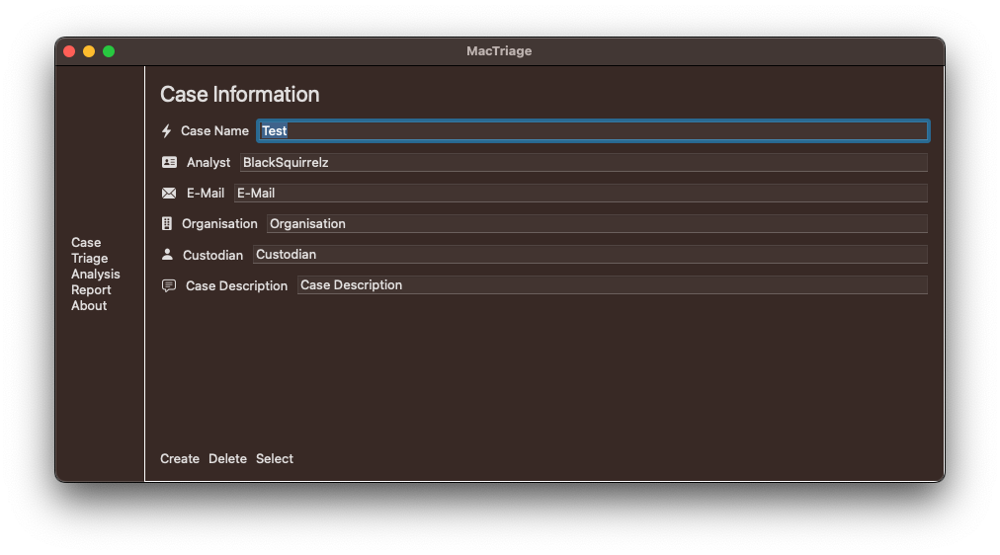

# macOS - Triage Application

## Table of Contents

- [macOS - Triage Application](#macos---triage-application)
  - [Table of Contents](#table-of-contents)
  - [Background](#background)
  - [Usecases](#usecases)
  - [Stories](#stories)
    - [UML 001 - Manage Case](#uml-001---manage-case)
    - [UML 002 - Create Triage](#uml-002---create-triage)
    - [UML 003 - Acquire Evidence](#uml-003---acquire-evidence)
    - [UML 004 -  Process Evidence](#uml-004----process-evidence)
    - [UML 005 -  Analyse Target System](#uml-005----analyse-target-system)
    - [UML 00 - Create Report](#uml-00---create-report)
  - [UML Class Diagrams](#uml-class-diagrams)
  - [Modules](#modules)
  - [Implemented Functionality](#implemented-functionality)
  - [Roadmap](#roadmap)
  - [References and Inspiration](#references-and-inspiration)
---

## Background

This is an application in development to create, manage, analyse and report on macOS Digital Forensics and Incident Reponse Cases.
It is a replacement for my previous tool NIDABA, since python is no longer natively installed on macOS Systems. Therefore porting, respectively newly creating an application in Swift.

---

## Usecases

The following usecase diagramm illustrates the intended usage of the application.

|#|Section|Manage Case|Create Triage| Acquire Evidence| Process Evidence| Triage Analysis| Create Report| Delete Case | View Case | Create Case | Close Case|
|---|---|---|---|---|---|---|---|---|---|---|---
|1|ID|001|002|003|004|005|006|007|008|009|010|
|2|Name|Manage Case|Create Triage| Acquire Evidence| Process Evidence| Triage Analysis| Create Report| Delete Case | View Case | Create Case | Close Case|
|3|Author|BS|BS|BS|BS|BS|BS|BS|BS|BS|BS|BS|BS|
|4|Priority|2|1|1|1|2|3|3|2|1|2|
|5|Criticatlity|Low|High|High|High|Medium|Low|Low|Medium|High|Medium|
|6|Source|
|7|Responsible|BS|BS|BS|BS|BS|BS|BS|BS|BS|BS|BS|BS|
|8|Description|
|9|Trigger|User calls case management from Main Menu|User triggers a new triage from within a case|
|10|Actors|
|11|Precondition|User needs to start the application, and a case needs to exist for deletion|
|12|Postcondition|None|
|13|Result|A. New Case generated, B. Case Selected, C. Existing Case deleted|Overview page with notable items that may need further investigation|Acquired evidence based on choosen acquisition path|Processed evidence based on acquired evidence|Triaged data with notable items|Report in pdf form|Deleted case|Opened case|Created new case|Closed Case|
|14|Main Scenario|The user wants to manage the cases, the options are to view, create, delete the case.|A new triage is done|The user can acquire evidence from the targeted Mac depending on the OS and Model number different options are available.|
|15|Alternative Scenario|
|16|Exceptional Scenario|
|17|Qualities|

## Stories
The following section contains the user stories.

### UML 001 - Manage Case

The analyst can create, delete and view a case / investigation.

- View Case
  The application returns a list of available cases in the default directory. If a custom directory was used, the analyst can select this in the file dialog.
  
- Delete Case
  The application provides a function to delete an existing case by providing the path to the case with the file dialog.

- Create Case
  The application provides a function to create a case. There must be a case name, and if another directory than the standard one is used, the path to the custom directory.

### UML 002 - Create Triage

Set Target for Triage, configuration, settings what to triage based TTP.
Quick overiew on the artifacts on the file system, highlighting notable stuff.

### UML 003 - Acquire Evidence

Acquisition of evidence (Actual Copying of files etc.)
Creates a copy of the relevant artifacts on an external drive, along with macOS Forensics best practice creates a .dmg file image.

### UML 004 -  Process Evidence

Parsing evidence using existing modules.

### UML 005 -  Analyse Target System

Presenting information about the target system in a logical form:
- Overview of System Information
- Based on the MITRE D3FEND Matrix show relevant artifacts, File, Message, Network, Platform, Identifier, Process and User Behavior.

### UML 00 - Create Report

Tagged files and evidence can be summarized in a report for the user to print as pdf.

---

## UML Class Diagrams

1. The following diagram depicts the Classes User and Case:

---

## Modules

---

## Implemented Functionality

- Create Case directory at user home.

## Roadmap

Whenever I have time I write code... if I have no time I don't write code. 

If you want to support this project, let me know, I would be **happy** to have support.

## References and Inspiration

1. [OSX Collector](https://github.com/Yelp/osxcollector)
2. [Aftermath](https://github.com/jamf/aftermath)
3. [macOS-Triage](https://github.com/nrvana/macOS-triage)
4. [Truetree](https://github.com/themittenmac/TrueTree)
5. [macOS-Locations Scraper](https://github.com/mac4n6/Mac-Locations-Scraper)
6. [OSX-Auditor](https://github.com/jipegit/OSXAuditor)
7. [MITRE D3FEND Matrix](https://d3fend.mitre.org/)
8. [MITRE ATT&CK Matrix](https://attack.mitre.org/matrices/enterprise/macos/)
