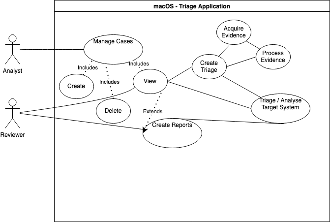
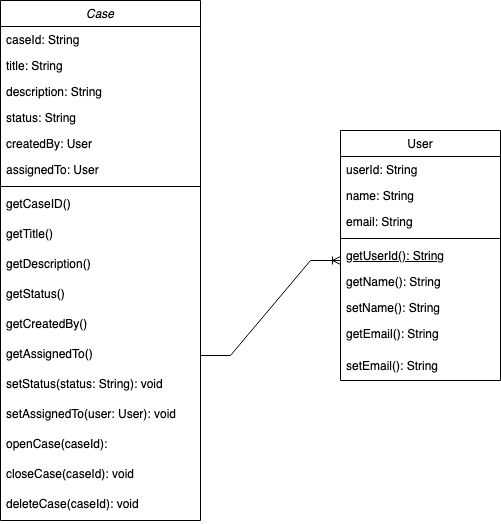

# macOS - Triage Application

## Table of Contents

- [macOS - Triage Application](#macos---triage-application)
  - [Table of Contents](#table-of-contents)
  - [Background](#background)
  - [Usecases](#usecases)
  - [Stories](#stories)
    - [Manage Case](#manage-case)
    - [Create Triage](#create-triage)
    - [Analyse Target System](#analyse-target-system)
    - [Create Report](#create-report)
  - [UML Class Diagrams](#uml-class-diagrams)
  - [References and Inspiration](#references-and-inspiration)
---

## Background

This is an application in development to create, manage, analyse and report on macOS Digital Forensics and Incident Reponse Cases.
It is a replacement for my previous tool NIDABA, since python is no longer natively installed on macOS Systems. Therefore porting, respectively newly creating an application in Swift.

---

## Usecases

The following usecase diagramm illustrates the intended usage of the application.

|#|Section|Manage Case|Create Triage| Acquire Evidence| Process Evidence| Triage Analysis| Create Report| Delete Case | View Case | Create Case | Close Case|
|---|---|---|---|---|---|---|---|---|---|---|---
|1|ID|001|002|003|004|005|006|007|008|009|010|
|2|Name|Manage Case|Create Triage| Acquire Evidence| Process Evidence| Triage Analysis| Create Report| Delete Case | View Case | Create Case | Close Case|
|3|Author|BS|BS|BS|BS|BS|BS|BS|BS|BS|BS|BS|BS|
|4|Priority|2|1|1|1|2|3|3|2|1|2|
|5|Criticatlity|Low|High|High|High|Medium|Low|Low|Medium|High|Medium|
|6|Source|
|7|Responsible|BS|BS|BS|BS|BS|BS|BS|BS|BS|BS|BS|BS|
|8|Description|
|9|Trigger|
|10|Actors|
|11|Precondition|
|12|Postcondition|
|13|Result|
|14|Main Scenario|
|15|Alternative Scenario|
|16|Exceptional Scenario|
|17|Qualities|

## Stories
The following section contains the user stories.

### Manage Case

The analyst can create, delete and view a case / investigation.

- View Case
- Delete Case
- Create Case

### Create Triage

- Acquire Evidence
- Process Evidence

### Analyse Target System

### Create Report

---

## UML Class Diagrams

1. The following diagram depicts the Classes User and Case:

---

## References and Inspiration

1. [OSX Collector](https://github.com/Yelp/osxcollector)
2. [Aftermath](https://github.com/jamf/aftermath)
3. [macOS-Triage](https://github.com/nrvana/macOS-triage)
4. [Truetree](https://github.com/themittenmac/TrueTree)
5. [macOS-Locations Scraper](https://github.com/mac4n6/Mac-Locations-Scraper)
6. [OSX-Auditor](https://github.com/jipegit/OSXAuditor)